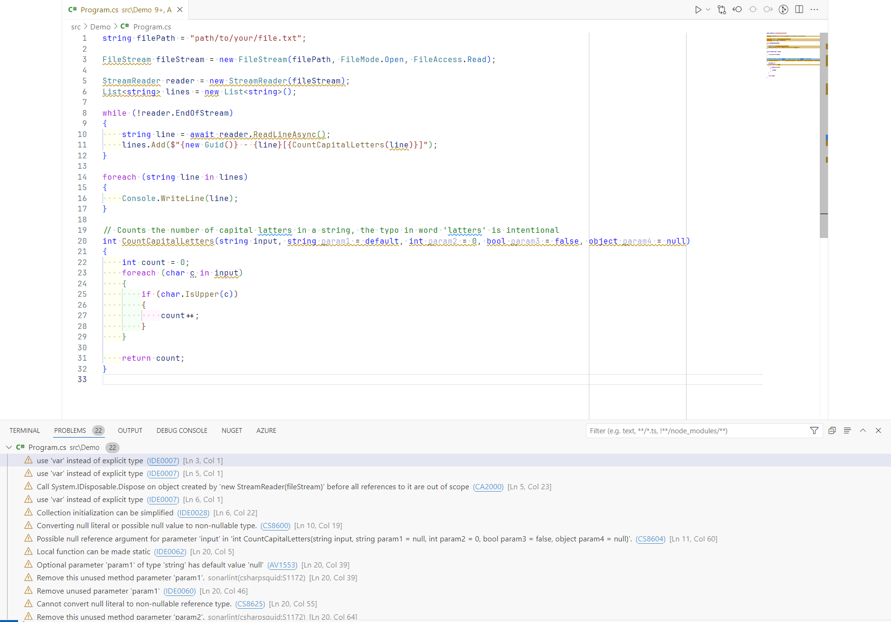
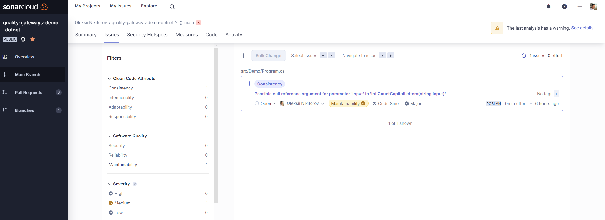
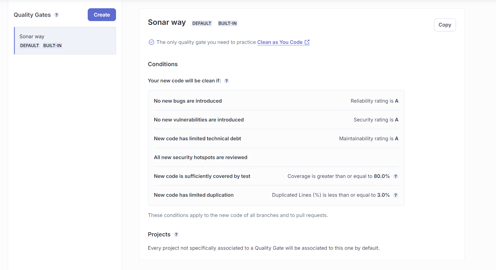
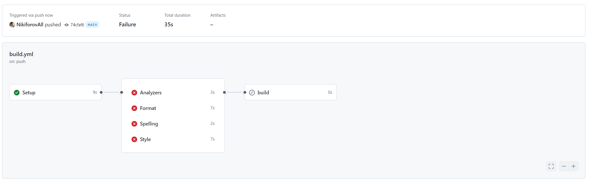
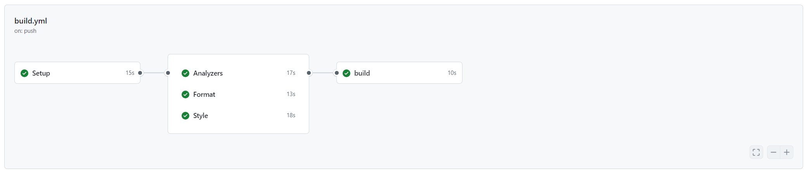

# A Tyrant Guide to Code Quality Gates featuring CSharpier, Husky.NET, and SonarCloud [](https://github.com/NikiforovAll/quality-gateways-demo-dotnet/actions/workflows/build.yml) [](https://github.com/NikiforovAll/quality-gateways-demo-dotnet/actions/workflows/sonar.yml)[](https://sonarcloud.io/summary/new_code?id=NikiforovAll_quality-gateways-demo-dotnet)


> Code quality is especially important in a team environment. The only way to achieve this is by enforcing quality gates. Quality gates are automated checks that the code meet quality standards.

There are two main aspects of enforcing quality gates:
1. Make sure that code quality is enforced, so it is not possible to merge code that does not meet the quality standards.
2. Keep the feedback loop as short as possible, so developers can fix the issues as soon as possible. Beware, developers will rebel against quality gates if it impacts their productivity and developer experience (DevEX).

Quality Attributes:

* Consistent formatting
* Consistent naming
* Consistent code style
* No spelling mistakes
* No code smells
* No security vulnerabilities
* No performance issues

🎯 This project, demonstrates how to enforce quality gates in a .NET project using the following tools:

* [Code Analysis](https://learn.microsoft.com/en-us/dotnet/fundamentals/code-analysis/overview) - .NET compiler platform (Roslyn) analyzers (shipped as part of the .NET SDK).
* [SonarAnalyzer.CSharp](https://rules.sonarsource.com/csharp/) - Custom analyzers for C# that are part of SonarCloud.
* [CSharpier](https://csharpier.com/) - CSharpier is an opinionated code formatter for C#.
* [cspell](https://streetsidesoftware.github.io/cspell/) - cspell is a command line tool that checks the spelling of your code.
* [Husky.Net](https://alirezanet.github.io/Husky.Net/) - Husky.Net is a .NET tool that allows you to run tasks before committing the code.
* [GitHub Actions](https://docs.github.com/en/actions) - Automate, customize, and execute your software development workflows.
* [SonarCloud](https://sonarcloud.io/) - SonarCloud is a cloud-based code analysis service that automatically detects bugs, vulnerabilities, and code smells in your code.


## Developer Feedback Loop

1. IDE/Linter
2. Pre-commit hooks
3. CI/CD
    1. Build
    2. Automated tests (unit, integration, end-to-end, performance, etc.)
    3. Code quality checks
    4. Security checks
4. Code Review

Assume we have initial code that does not meet the quality standards.



1. First of all, the developer will receive feedback from the IDE and linter.
2. Before committing the code, Husky will run pre-commit hooks. And if any of the checks fail, the commit will be rejected.
3. The CI/CD pipeline will run the same checks (and maybe other checks such as automated tests). And if any of the checks fail, the pipeline will fail.

☝️ Note, not all checks are equal. For example, you don't really want to run the entire test suite in the pre-commit hook. You want to run only the fast checks.

## Code Quality Aspects

### Code Formatting

I prefer csharpier, because it is fast and has a good default configuration. It is an opinionated code formatter for C#. It is similar to Prettier, and the [philosophy](https://prettier.io/docs/en/option-philosophy.html) is to have a single way to format the code.

I don't want to spend time discussing code formatting in code reviews. I want to have a single way to format the code, and I want to have it done automatically.

The only option you can argue about is the line length. The default line length is 120 characters, but you can change it to 80 characters if you prefer.

### Spelling

Spelling mistakes can be detected by the `cspell linter`. It is a fast and configurable spell checker that runs in the terminal.

### Coding Style & Code Analysis

Coding style can be enforced by standard analyzers, the configuration of which can be stored in the `.editorconfig` file. The analyzers can be configured to enforce the coding style, and the IDE can be configured to show warnings and errors.

Code analysis rules have various configuration options. Some of these options are specified as key-value pairs in an analyzer configuration file (`.editorconfig`).

You can configure the severity level for any rule, including [code quality](https://learn.microsoft.com/en-us/dotnet/fundamentals/code-analysis/quality-rules/) rules and [code style](https://learn.microsoft.com/en-us/dotnet/fundamentals/code-analysis/style-rules/) rules. For example, to enable a rule as a warning, add the following key-value pair to an analyzer configuration file:

```ini
[*.{cs,vb}]
# IDE0040: Accessibility modifiers required
dotnet_diagnostic.IDE0040.severity = warning
# or
# IDE0040: Accessibility modifiers required
dotnet_style_require_accessibility_modifiers = always:warning
```

.NET compiler platform (Roslyn) analyzers inspect your code for code quality and style issues. Starting in .NET 5, these analyzers are included with the .NET SDK and you don't need to install them separately.

While the .NET SDK includes all code analysis rules, only some of them are enabled [by default](https://github.com/dotnet/roslyn-analyzers/blob/main/src/NetAnalyzers/Core/AnalyzerReleases.Shipped.md). The analysis mode determines which, if any, set of rules to enable. You can choose a more aggressive analysis mode where most or all rules are enabled.

Additionally, you may consider the following analyzers:

* <https://github.com/bkoelman/CSharpGuidelinesAnalyzer>
* <https://github.com/SonarSource/sonar-dotnet>
* <https://github.com/dotnet/roslynator>
* <https://github.com/meziantou/Meziantou.Analyzer>
* <https://github.com/SergeyTeplyakov/ErrorProne.NET>

☝️ Note, you don't have to adopt analyzers entirely. You can use only the rules that make sense for your project.

🧠 My suggestion is to work on the code quality and code style rules together with the team during the code review process. The rules should be discussed and agreed upon by the team.

There are two other options to enforce coding style:

* [TreatWarningsAsErrors](https://learn.microsoft.com/en-us/dotnet/csharp/language-reference/compiler-options/errors-warnings#treatwarningsaserrors) - All warning messages are instead reported as errors. The build process halts (no output files are built).
* [EnforceCodeStyleInBuild](https://learn.microsoft.com/en-us/dotnet/core/project-sdk/msbuild-props#enforcecodestyleinbuild) - .NET code style analysis is disabled, by default, on build for all .NET projects.

From my experience, it can negatively impact the local build time, so I prefer to run the checks in the CI/CD pipeline.

💡 The only exception to this is to use `<WarningsAsErrors>Nullable</WarningsAsErrors>` to treat nullable warnings as errors.

### Code Analysis Tools

If you want to go further, you can use code analysis tools. The difference between code analysis tools and code analyzers is that code analysis tools are external tools that analyze your codebase and provide insights into the quality of your code.

Some of the popular tools are:

* [SonarCloud](https://sonarcloud.io/) - SonarCloud is a cloud-based code analysis service that automatically detects bugs, vulnerabilities, and code smells in your code. It integrates with GitHub, Azure DevOps, and Bitbucket.
* [CodeQL](https://securitylab.github.com/tools/codeql) - CodeQL is a semantic code analysis engine that allows you to write queries to find vulnerabilities in your code.
* [NDepend](https://www.ndepend.com/) - NDepend is a static analysis tool that helps you manage complex .NET codebases and achieve high code quality.

Here is an example of a SonarCloud report:



💡 You can include `SonarCloud` check as part of a CI/CD pipeline. Use `/d:sonar.qualitygate.wait=true` option. Otherwise, the CI/CD pipeline will not wait for the SonarCloud analysis to finish.

By default, Sonar configures pretty strict rules called "Sonar Way":



👎 The downside of using different code analysis tools is that you have to configure them separately. You have to configure the rules, the severity levels, and the exclusions. Ideally, I want to have a single configuration file (aka source of truth) that configures all the code quality checks.

## Running the demo

Prerequisites:

* `dotnet tool restore`
* `npm install -g cspell`

Run it:

```bash
dotnet run husky
```

This command runs the following checks sequentially:

```json
{
    "$schema": "https://alirezanet.github.io/Husky.Net/schema.json",
    "tasks": [
        {
            "name": "format",
            "group": "pre-commit",
            "command": "dotnet",
            "args": ["csharpier", ".", "--check"]
        },
        {
            "name": "style",
            "group": "pre-commit",
            "command": "dotnet",
            "args": ["format", "style", ".", "--verify-no-changes"]
        },
        {
            "name": "analyzers",
            "group": "pre-commit",
            "command": "dotnet",
            "args": ["format", "analyzers", ".", "--verify-no-changes"]
        },
        {
            "name": "spelling",
            "group": "pre-commit",
            "command": "cspell",
            "args": ["lint", "**.cs", "--no-progress", "--no-summary"]
        }
    ]
}
```

We can run the checks individually:

```bash
dotnet husky run --name format
```

```bash
dotnet husky run --name style
```

```bash
dotnet husky run --name analyzers
```

```bash
dotnet husky run --name spelling
```

Now, assume the developer ignores the warning and somehow commits the code and creates a pull request. The CI/CD pipeline will run the same checks, and if any of the checks fail, the pipeline will fail.

💡 I configured parallel execution for code quality gates, which helps to receive feedback faster.



Now let's fix the issues and run the checks again.

```bash
❯ dotnet husky run
[Husky] 🚀 Loading tasks ...
--------------------------------------------------
[Husky] ⚡ Preparing task 'format'
[Husky] ⌛ Executing task 'format' ...
Formatted 1 files in 952ms.
[Husky]  ✔ Successfully executed in 2,307ms
--------------------------------------------------
[Husky] ⚡ Preparing task 'style'
[Husky] ⌛ Executing task 'style' ...
[Husky]  ✔ Successfully executed in 15,299ms
--------------------------------------------------
[Husky] ⚡ Preparing task 'analyzers'
[Husky] ⌛ Executing task 'analyzers' ...
[Husky]  ✔ Successfully executed in 12,293ms
--------------------------------------------------
[Husky] ⚡ Preparing task 'spelling'
[Husky] ⌛ Executing task 'spelling' ...
[Husky]  ✔ Successfully executed in 2,802ms
--------------------------------------------------
```

💡 Note: The pre-commit hook takes about 30 seconds. This is already too long, so we might consider removing something from the git hook and relying only on the CI/CD.

Now, we commit the changes and push them to the repository. The CI/CD pipeline will run the checks again, and if all checks pass, the pipeline will succeed.



## References

- <https://alirezanet.github.io/Husky.Net/>
- <https://csharpier.com/>
- <https://docs.sonarsource.com/sonarcloud/>
- <https://rules.sonarsource.com/csharp/>
- <https://github.com/bkoelman/CSharpGuidelinesAnalyzer>
- <https://github.com/streetsidesoftware/cspell>
- <https://learn.microsoft.com/en-us/dotnet/fundamentals/code-analysis/configuration-options>
- <https://microsoft.github.io/code-with-engineering-playbook/developer-experience/>
